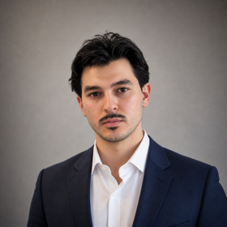

<h1 align="center">Hi, I'm Nader 👋</h1>

  

  <b>EV charging software engineer</b> 
  OCPP backend systems · charge point software · OCTT certification 
  @ <a href="https://www.alpitronic.com/">Alpitronic</a> — Munich, Germany 🇩🇪

---

I work on the software side of EV charging — the protocols and backend systems that let chargers talk to the cloud and to vehicles (OCPP, ISO 15118, OCPI). I also write **[Charging Insider](https://charginginsider.com)**, a technical blog explaining how EV charging actually works under the hood, written by someone building it.

### 🔧 Projects

- **[ocpp-rag](https://github.com/nader0913/ocpp-rag)** — MCP server with a RAG knowledge base for OCPP 1.6, OCPP 2.0.1, and EV charging standards · `Python`
- **[veilcomm](https://github.com/nader0913/veilcomm)** — A partial Tor protocol implementation · `Rust`
- **[Charging Insider](https://charginginsider.com)** — Technical blog on OCPP, ISO 15118, and charger internals

### 📫 Get in touch

- 🌐 Blog — [charginginsider.com](https://charginginsider.com)
- 💼 LinkedIn — [Nader Ouerdiane](https://www.linkedin.com/in/nader-ouerdiane-4a6b92142/)
- ✉️ Email — [nader.business.mail@gmail.com](mailto:nader.business.mail@gmail.com)

<!-- profile -->
